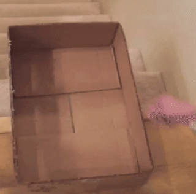

# Alfresco Animated Gif Transformer Engine

## Purpose
This project extends the [example Hello World transformer](https://github.com/Alfresco/alfresco-helloworld-transformer) to allow conversion of mp4 videos into animated gifs.

It was a hackathon project in January 2022.



See the [parent project](https://github.com/Alfresco/alfresco-transform-core) for more information and instructions on how to build & run.

---
**NOTE**

Much of this project and the remainder of this README contains references to the Hello World transformer.

---

## Prerequisites
* Java 11
* Maven
* Docker

## Build using Maven
The project can be built by running the Maven command:
```bash
mvn clean install -Plocal
```
This will build the project as a Spring Boot fat jar in the {project directory}/target folder
and as a docker image in the local docker registry.

Before proceeding to start the container, confirm that the build was successful and the local docker
registry contains **alfresco/alfresco-helloworld-transformer** image.

## Run in Docker

Execute the following commands to run the transformer container in detached mode on port 8090 and to show the logs:

```bash
docker run -d -p 8090:8090 --name alfresco-helloworld-transformer alfresco/alfresco-helloworld-transformer:latest
docker logs -f alfresco-helloworld-transformer
```

> Since this is a Spring Boot application,
 it might be helpful to run it as such during development by either executing `mvn spring-boot:run`
 or `java -jar target/alfresco-helloworld-transformer-{version}.jar` in the project directory.
 The application will be accessible on port 8090.

The transformation configuration is defined in [engine_config.json](src/main/resources/engine_config.json) and requires a source *.txt file
which is no more than 50 bytes in size. If you attempt to upload a larger file then the TransformController will log an error:
```
No transforms were able to handle the request
```

## Additional notes

##### Using custom package names
The Hello World example uses Spring dependency injection to wire beans.
For this to work, Spring component scan needs to include the 'org.alfresco.transformer' package, which it does by default.
It is ok to change this package name, but the 'org.alfresco.transformer' will need to be added back for
component scanning. Spring provides several ways to do this, one of which is to add @ComponentScan annotation
to the Application with the new package and the 'org.alfresco.transformer' package configured for component scanning.

##### Issues with fabric8-maven-plugin
Ensure that the Docker installation has Docker Experimental Features enabled.
